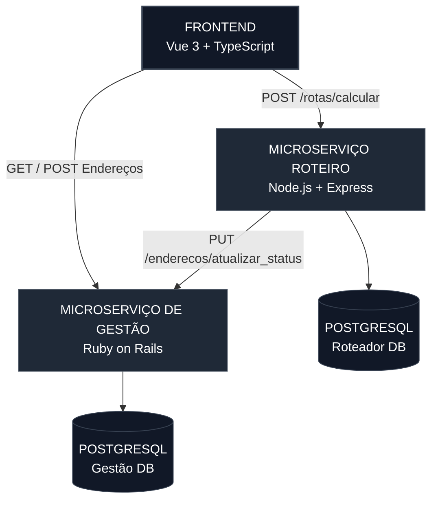
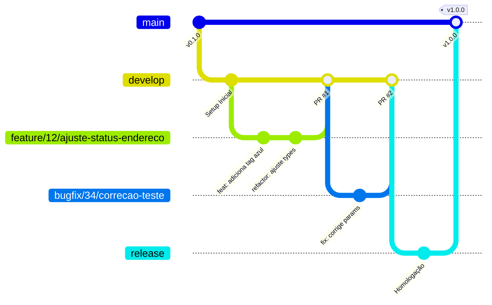

# Mini Roteirizador de Entregas

Este projeto consiste em um sistema de gerenciamento e roteirização simplificada de entregas logísticas, projetado sob uma arquitetura de microserviços totalmente conteinerizada e orquestrada via Docker. O objetivo principal é gerenciar pontos de entrega, frotas e motoristas, calculando o itinerário ideal de forma automatizada.

---

## Arquitetura do Sistema

A solução foi modularizada em três componentes independentes para garantir o isolamento de escopo, escalabilidade e manutenibilidade do ecossistema:

1. **Frontend (SPA)**: Renders em tempo real construídos em Vue 3 + TypeScript, consumindo de forma reativa os dados consolidados do ecossistema.
2. **Microserviço de Gestão**: API RESTful desenvolvida em Ruby on Rails responsável pelas regras de negócio centrais, persistência de entidades e governança de transações via banco de dados relacional.
3. **Microserviço de Roteirização**: Engine em Node.js com TypeScript focado no processamento assíncrono e ordenação inteligente das coordenadas geográficas enviadas.


---

## Tecnologias Utilizadas

### Frontend
* **Vue 3** (Composition API) com **TypeScript** para tipagem estática e segurança em tempo de compilação.
* **Pinia** para gerenciamento de estado global centralizado e reativo.
* **Tailwind CSS** para interfaces responsivas, limpas e de alta usabilidade.
* **Lucide Vue Next** para pacote de iconografia vetorial.

### Back-end & Microserviços
* **Ruby on Rails 7** (Modo API) com **ActiveRecord ORM** para governança ágil e concisa de dados.
* **Node.js (Express)** com **TypeScript** e **Prisma ORM** para a engine de processamento de rotas.

### Infraestrutura & Banco de Dados
* **Docker** & **Docker Compose** para isolamento completo de ambientes.
* **PostgreSQL** como motor de persistência relacional para ambos os microserviços (bancos isolados por contexto).

---

## Instruções de Setup e Inicialização

Toda a infraestrutura é orquestrada de forma nativa. 

### Pré-requisitos
- Docker e Docker Compose instalados.

### 1. Subir a Infraestrutura

Abra o terminal na raiz do projeto e execute o comando abaixo para construir as imagens e iniciar os containers em background:

```bash
docker-compose up 
```

### 2. Popular o Ambiente (Seeds)
Para acelerar o processo de testes e validação das jornadas de usuário, criei um script de sementes (seed) estruturado com motoristas, frotas prontas e coordenadas geográficas válidas (focadas na região de Campo Grande - MS). Execute o comando abaixo para popular o Postgres: (após o docker-compose up)

```bash
docker-compose exec management-api bin/rails db:seed
```

---

## Endpoints Principais (Fluxo de Integração)

### Microserviço de Gestão (Ruby)
- GET /enderecos - Retorna a listagem de destinos com os status (pendente, em rota, entregue).
- PUT /enderecos/atualizar_status - Atualiza em lote o estado reativo dos endereços e vincula o ID do veículo ao lote correspondente.
- GET /rotas - Alimenta o histórico e os cards de monitoramento ativos na Dashboard.

### Microserviço de Roteirização (TypeScript)
- POST /rotas/calcular - Recebe um conjunto de IDs e processa a ordenação ideal de paradas baseada na proximidade latitudinal/longitudinal, devolvendo as métricas ao ecossistema.

---

## Decisões de Engenharia

### GCS - Gerência de Configuração

Para garantir a estabilidade do código em produção e organizar o trabalho em equipe, o projeto adota o modelo **GitFlow** como estratégia de ramificação (branching) e ciclo de vida do software, toda branch nova criada recebe como "prefixo" a identificação da issue relacionada.

#### Branches Principais

- `main`: Reflete o código em estado de produção (estável e homologado). Cada commit nesta branch gera uma nova tag de versão semanticamente estruturada (ex: `v1.0.0`).
- `develop`: Branch de integração contínua. Contém o código com as últimas funcionalidades prontas e testadas, servindo de base para o próximo ciclo de `release`.
- `release`: Branch para armazenar códigos prontos e testados prontos para serem mergeados a branch `main`.

#### Branches de Suporte

- `feature/*`: Criadas a partir da `develop` para o desenvolvimento de novas tarefas ou refatorações (ex: `feature/12/ajuste-status-endereco`). Após a conclusão, são integradas de volta à `develop` exclusivamente via **Pull Request (PR)** aprovado.
- `bugfix/*`: Criadas apartir da `develop` para corrigir algum bug encontrado em meio a testes e validações de novas funcionalidades e mergeadas de volta a `develop` após solução do bug encontrado, exclusivamente via **Pull Request (PR)** aprovado.



### Padrão de Commits (Conventional Commits)

Visando a clareza do histórico do Git e a automação do changelog, as mensagens de commit devem seguir a especificação de commits convencionais:

- `feat`: Uma nova funcionalidade sendo introduzida (ex: `feat(vue): adiciona tag azul de em rota na listagem`).
- `fix`: A correção de um bug (ex: `fix(rails): impede nulo convertendo array de ids para string`).
- `docs`: Alterações exclusivas na documentação (ex: `docs: atualiza instruções de setup do docker no readme`).